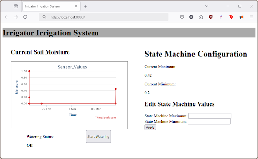
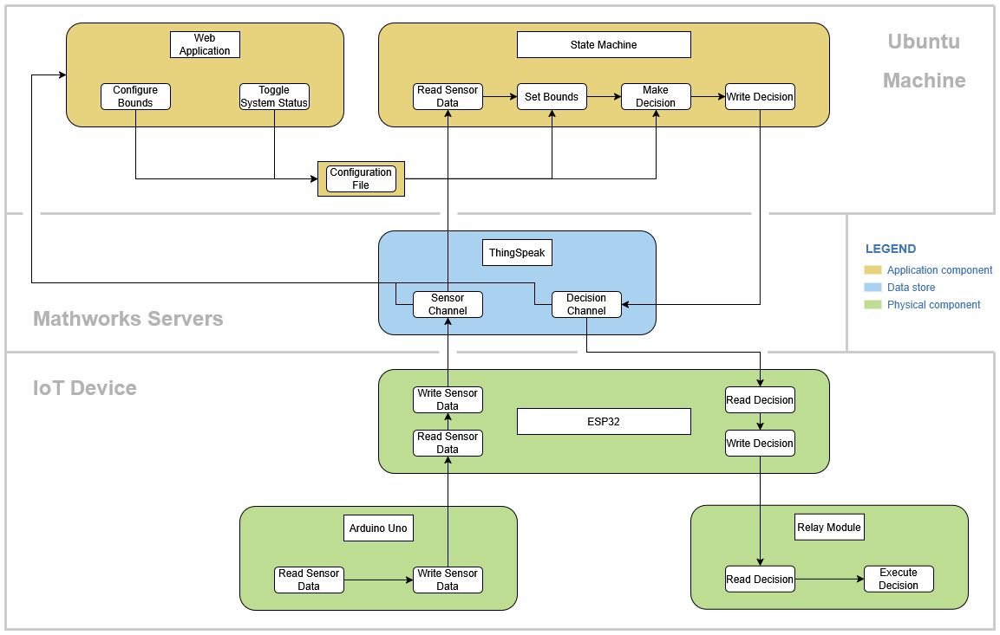

# Smart Indoor Watering System

Water conservation is a critical challenge in agriculture. Traditional irrigation methods often waste resources and harm plants due to inefficient water distribution. This project leverages IoT sensors and MathWorks tooling to optimize indoor irrigation for leafy-green gardening, ensuring plants receive the right amount of water at the right time with minimal human involvement.


## Table of Contents

- [Overview](#overview)
- [Features](#features)
- [System Architecture](#system-architecture)
- [Prerequisites](#prerequisites)
- [Installation](#installation)
- [Team Responsibilities](#team-responsibilities)


## Overview

This smart watering system monitors soil moisture and other environmental conditions using IoT sensors. The data is sent to ThingSpeak for real-time analysis using MATLAB. A MATLAB-based state machine determines whether to initiate watering. The goal is to minimize water consumption and optimize plant growth in indoor environments like those around Gonzaga.


## Features


- Real-time soil moisture monitoring (see video setup/stateMachineDemo)
- Automated irrigation control
- Integration with ThingSpeak and MATLAB
- ESP32 + Arduino-based hardware system
- Web dashboard hosted via Nginx (see video setup/WebsiteDemo)


## System Architecture


- **Sensors:** Soil moisture sensor
- **Microcontrollers:** Arduino Uno R3, ESP32
- **Communication:** Wi-Fi data transmission to ThingSpeak
- **Data Analysis:** MATLAB scripts and state machine
- **Interface:** Nginx-hosted dashboard for system visualization


## Prerequisites

### Software Requirements

- MATLAB (with ThingSpeak support)
- Arduino IDE
- ESP32 board drivers
- Nginx (for dashboard hosting)
- PHP (for dashboard hosting)

### Hardware Requirements

- Arduino Uno R3
- ESP32 Wi-Fi module
- Soil moisture sensors
- Relay + water pump system


## Installation

### Prerequisite Installation and Setup

1. Create a thingSpeak account [here](https://thingspeak.mathworks.com/login?skipSSOCheck=true).
2. Create two ThingSpeak channels [here](https://www.mathworks.com/help/thingspeak/collect-data-in-a-new-channel.html).
  - Each channel should only have one field.
  - One channel should be designated to host the State Machine state or "decision" (1 or 0)
  - One channel should be designated to host sensor values
3. Verify Matlab installation on linux machine or install Matlab now.
  - All irrigators code is written for Matlab version 2024b.
4. Verify installation or install Nginx on linux machine.
5. Verify instalation or install PHP on linux machine.
6. Configure Nginx to run PHP. 
  - Documentation can be found [here](https://www.php.net/manual/en/install.unix.nginx.php), but much more straightforward guides can be found with the help of your prefered search engine.
  
### State Machine and Dashboard Installation and Setup

4. Download and unzip 'Irrigator_Installation.zip'.
5. Copy or move the '/irrigator' directory to prefered location.
7. Run 'sudo ./create_configs.sh' OR edit the config files found in '/configs' and move them to designated folders on system.
  - Further information on config files can be found in the README under '/configs'
8. Copy all files in '/html' to '/var/www/html' to enable Dashboard.
  - The Dashboard can be viewed by visiting http://localhost on your web browser with Nginx enabled.
9. Run './startMatlabApp' to start Irrigator's Irrigation Sytem State Machine and Dashboard! 

### Hardware Deployment

*If you are installing from zip, hardware can be found under the '/hardware' directory.*

1. Deploy sensors and connect to the Arduino + ESP32 using setup/wiring_diagram.
2. Configure src/hw/secrets.h.example for connecting to Wifi and ThingSpeak and remove .example from file name.
3. Upload src/hw/arduino_program.ino to the Arduino.
4. Upload src/hw/esp32_driver.cpp to the ESP32.


## Testing

To run the state machine unit tests, execute the following command at ```test/sm```:

```shell
matlab -batch "run('run_sm_tests.m');"
```


## Team Responsibilities

- **ThingSpeak Integration:** Mads, Caleb, Matt  
- **MATLAB State Machine:** Caleb  
- **Dashboard (Nginx):** Mads  
- **Hardware (Arduino + ESP32):** Arvand, Matt  


## License

This project is licensed under the MIT License. See the [LICENSE](setup/LICENSE) file for details.


